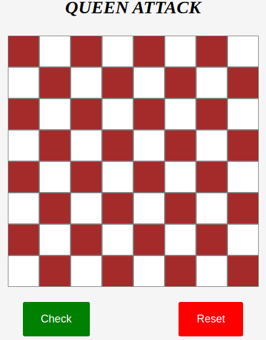

# JS Queen Attack

this project is all about given the position of two queens on a chess board, indicate whether or not they are positioned so that they can attack each other. In the game of chess, a queen can attack pieces that are on the same row, column, or diagonal.

## App

### Built With

- HTML
- CSS
- JS

### Prerequisites

Knowledge about:

- HTML
- CSS
- Google chrome
- JS

## Clone project

- To get a local copy up and running follow these simple example steps.
- Clone this repository with `git@github.com:NoubissiViany/jsQueenAttack.git` using your terminal.
- Change to the project directory by entering: cd jsQueenAttack the terminal.

## steps

- $ git clone `git@github.com:NoubissiViany/jsQueenAttack.git`
- $ `cd jsQueenAttack`
- $ `git checkout  feature/jsQueenAttack`

## Start App

- run by opening the index.html in the browser

## Author

👤 **NoubissiViany**

- GitHub: [@NoubissiViany](git@github.com:NoubissiViany/jsQueenAttack.git)

## 📝 License

This project is [Rebase Academy](./LICENSE) licensed.
